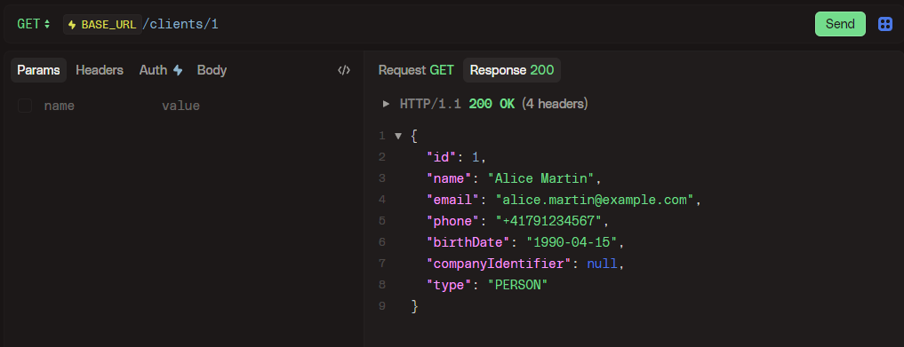
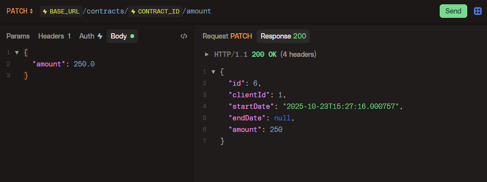
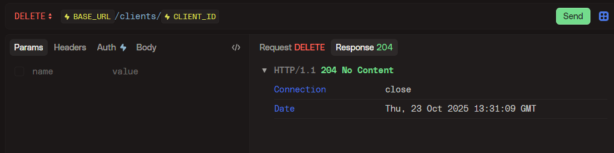

# Client and contract management backend

---

## Running the project
### Prerequisties
- Docker (to run the PostgreSQL container)
- Java 17+
- Maven 3.8+

### Start the database
Once docker is installed on your machine, you can run the following command:
```bash
docker run -e POSTGRES_PASSWORD=secret -v postgres_data:/var/lib/postgresql -p 5432:5432 -d postgres:18
```

### Start the application
First, configure the database connection in `.env` (copy `.env.example`), then run
```bash
./mvnw spring-boot:run
```

### API Documentation
A swagger documentation can be found at <http://localhost:8080/swagger-ui>

---

## Proof that the API works
### **Step 1 — Create a person client**

**Request:**
`POST /clients`

```json
{
  "type": "PERSON",
  "name": "Alice Martin",
  "email": "alice.martin@example.com",
  "phone": "+41791234567",
  "birthDate": "1990-04-15"
}
```


---

### **Step 2 — Create a company client**

**Request:**
`POST /clients`

```json
{
  "type": "COMPANY",
  "name": "TechNova SA",
  "email": "contact@technova.ch",
  "phone": "+41221234567",
  "companyIdentifier": "TNV-001"
}
```


---

### **Step 3 — Retrieve one client**

**Request:**
`GET /clients/1`



---

### **Step 4 — Update one client’s information**

**Request:**
`PUT /clients/1`

```json
{
  "name": "Alice Dupont",
  "email": "alice.dupont@example.com",
  "phone": "+41795554433",
  "type": "PERSON"
}
```


---

### **Step 5 — Create two contracts for Alice**

**Request 1:**
`POST /contracts`

```json
{
  "amount": 200.0,
  "startdate": "2025-10-01"
}
```

**Request 2:**
`POST /contracts`

```json
{
  "amount": 350.0,
  "startdate": "2025-09-15",
  "enddate": "2025-12-31"
}
```


---

### **Step 6 — Retrieve Alice’s active contracts**

**Request:**
`GET /clients/1/contracts`


---

### **Step 7 — Update the cost amount of one contract**

**Request:**
`PATCH /contracts/6/amount`

```json
{ 
  "amount": 250.0
}
```



---

### **Step 8 — Get the total cost of all active contracts**

**Request:**
`GET /clients/1/contracts/active/sum`


---

### **Step 9 — Delete the client**

**Request:**
`DELETE /clients/1`




The `end_date` as been updated!

---

### **Step 10 — Check Alice’s contracts again**

**Request:**
`GET /clients/1/contracts`


---

## Why this architecture?
I chose to use the architecture I learned during my classes at the École des Métiers in Fribourg: a layered structure with models, DTOs, repositories, services, and controllers. I find this architecture pleasant to work with, as it keeps responsibilities clearly separated where they should be.

For the models, I could have chosen to use polymorphism — which would make sense for the Client entity, since it can exist in two types with specific fields for each. However, I preferred a more “classic” approach for a small demonstration project like this one. For a project expected to grow in the future, though, polymorphism would in my opinion be the ideal choice.

Overall, it follows a fairly standard MVC2 pattern. I also tried to make the API as user-friendly as possible.